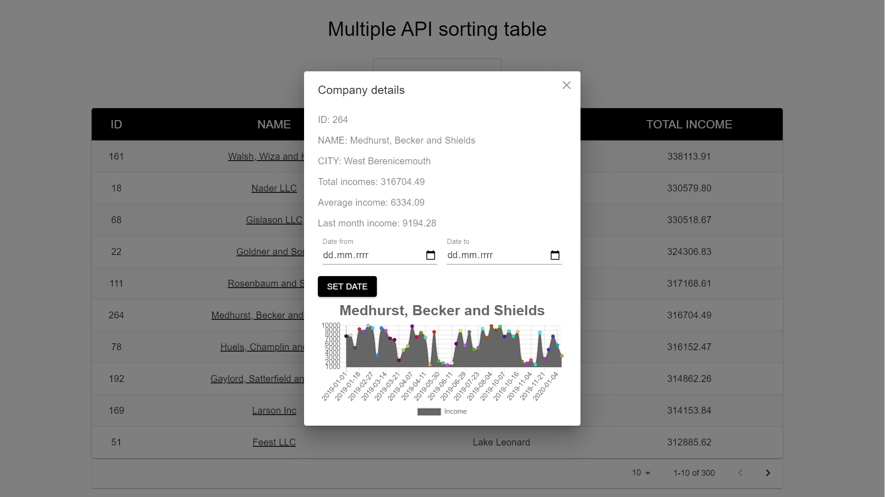

# Multiple API sorting table.

A useful application built into React that sorts information about companies downloaded from the external API.

## Technologies.

- React
- Material-UI
- Chart.js

## Used:

- multiple API
- gh-pages

## Features

- The table displays: identifier, name, city and total income of the company.
- The table is sorted by total income (descending).
- After filling in the "enter company name" field, the application will filter results by  
  company name.
- It is also possible to filter the table results in ascending / descending order, just click on
  the column we are interested in (ID, NAME, CITY and TOTAL INCOME)
- After selecting the company name, detailed information appears: total and average income
  (with the option to set the date range), income from the last month and a graph showing the company's income.
- The results are paginated.
- The application is responsive.

## Screenshots




## Setup

To clone and run this application, you'll need Git and React installed on your computer:

```
# Clone this repository

# Go into the repository
$ cd

# Install react-app
$ npm i

# Run the app
$ npm start

or just visit: Live preview.
```

## Live Preview:

Check the preview here: https://bercik468.github.io/multiple_api_sorting_table_v2/

## Contact

Created by bercik468@gmail.com - feel free to contact me!
